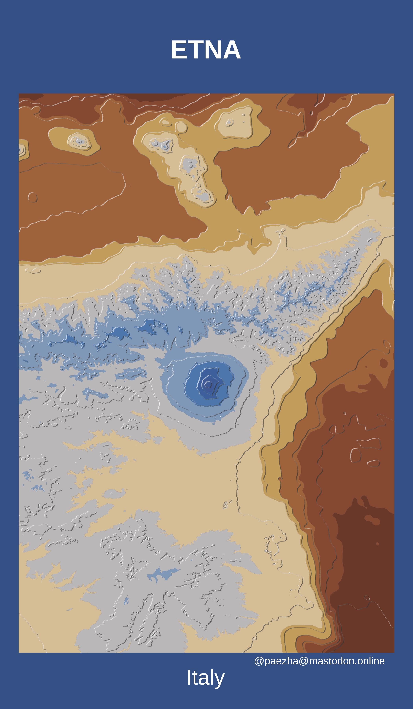

<!-- README.md is generated from README.Rmd. Please edit that file -->

```{r, include = FALSE}
knitr::opts_chunk$set(
  collapse = TRUE,
  comment = "#>"
)
```

# Mapstodon

<!-- badges: start -->
<!-- badges: end -->

This repository is where I keep mapping projects that I share on [Mastodon](https://mastodon.online/@paezha).

## Tanaka Contours

- [Etna](https://github.com/paezha/Mapstodon/tree/master/tanaka-contours-etna)


