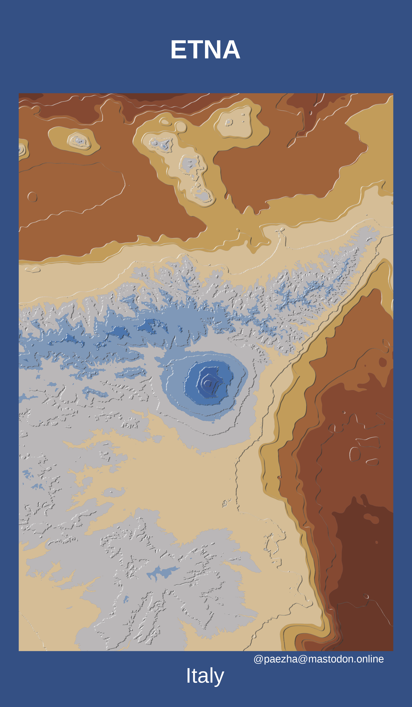

<!-- README.md is generated from README.Rmd. Please edit that file -->

# Mapstodon

<!-- badges: start -->
<!-- badges: end -->

This repository is where I keep mapping projects that I share on
[Mastodon](https://mastodon.online/@paezha).

## Contents

-   [Tanaka Contours](#tanaka-contours)

## Tanaka Contours

[Mount
Etna](https://github.com/paezha/Mapstodon/tree/master/tanaka-contours-etna)

# 

[Mount
Stromboli](https://github.com/paezha/Mapstodon/tree/master/tanaka-contours-stromboli)

# 

[Mount
Vesuvius](https://github.com/paezha/Mapstodon/tree/master/tanaka-contours-vesuvius)

# 

[Mount
Vulture](https://github.com/paezha/Mapstodon/tree/master/tanaka-contours-vulture)

# 

[Puy de
Sancy](https://github.com/paezha/Mapstodon/tree/master/tanaka-contours-puy-de-sancy)

