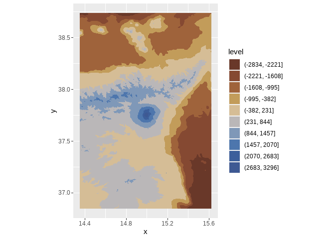

<!-- README.md is generated from README.Rmd. Please edit that file -->

# Etna

In this notebook I create a contour map of stratovolcano Etna in Italy.
The map uses open data and [Tanaka
contours](http://wiki.gis.com/wiki/index.php/Tanaka_contours).

I will use the following packages:

``` r
library(elevatr) # To get elevation data
#> Warning: package 'elevatr' was built under R version 4.2.2
library(MexBrewer) # Color palettes
library(metR) # For contouring 
#> Warning: package 'metR' was built under R version 4.2.2
library(showtext) # For importing fonts
library(terra) # To work with rasters
library(tidyverse) # Data carpentry and ggplot2
```

## Load fonts

Import Google Fonts:

``` r
font_add_google("Amatic SC", "pressstart")

showtext_auto()
```

## Retrieve open elevation data

Use {elevatr} to get elevation data:

``` r

etna <- get_elev_raster(locations = data.frame(x = c(14.3534, 15.6234), 
                                               y = c(36.8466, 38.736)),
                        z = 10, 
                        prj = "EPSG:4326",
                        clip = "locations")
#> Mosaicing & Projecting
#> Clipping DEM to locations
#> Note: Elevation units are in meters.
```

Convert to {terra} `SpatRaster` object and thereof to data frame:

``` r
etna <- rast(etna)

etna <- as.data.frame(etna, 
                      xy = TRUE) %>%
  rename(elev = 3)
```

Plot contours; use a palette from
[{MexBrewer}](https://github.com/paezha/MexBrewer):

``` r
cols <- mex.brewer("Alacena", n = 11)

ggplot(data = etna,
       aes(x, y, z = elev)) +
  geom_contour_filled(breaks = seq(min(etna$elev), 
                                   max(etna$elev), 
                                   length.out = 11)) +
  #geom_contour_tanaka() + 
  scale_fill_manual(values = cols) +
  coord_equal()
```

<!-- -->

Repeat plot but now with Tanaka countours:

``` r
ggplot(data = etna,
       aes(x, y, z = elev)) +
  geom_contour_filled(breaks = seq(min(etna$elev), 
                                   max(etna$elev), 
                                   length.out = 11)) +
  geom_contour_tanaka(sun.angle = 60, 
                      smooth = 10) + 
  scale_fill_manual(values = cols) +
  ggtitle("ETNA") +
  labs(subtitle = "Italy", caption = "@paezha@mastodon.online") +
  coord_equal() +
  theme_void() + 
  theme(legend.position = "none",
        plot.background = element_rect(color = NA,
                                       fill = cols[11]),
        plot.title = element_text(color = "white",
                                  face = "bold",
                                  size = 100, 
                                  hjust = 0.5,
                                  vjust = -3),
        plot.subtitle = element_text(color = "white",
                                     size = 80, 
                                     hjust = 0.5,
                                     vjust = -142),
        plot.caption = element_text(color = "white",
                                    size = 40,
                                    hjust = 0.9,
                                    vjust = 14))

ggsave("etna-tanaka-contours.png",
       #width = 8,
       height = 12,
       units = "in")
#> Saving 7 x 12 in image
```


