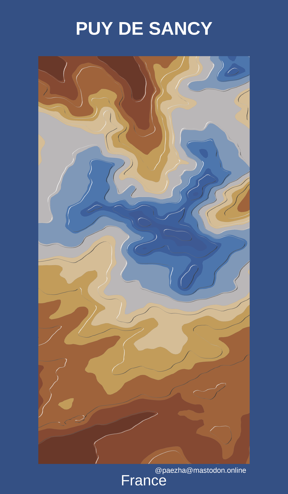

<!-- README.md is generated from README.Rmd. Please edit that file -->

```{r, include = FALSE}
knitr::opts_chunk$set(
  collapse = TRUE,
  comment = "#>"
)
```

# Puy de Sancy

In this notebook I create a contour map of stratovolcano Puy de Sancy in France. The map uses open data and [Tanaka contours](http://wiki.gis.com/wiki/index.php/Tanaka_contours).

I will use the following packages:
```{r message=FALSE}
library(elevatr) # To get elevation data
library(MexBrewer) # Color palettes
library(metR) # For contouring 
library(showtext) # For importing fonts
library(terra) # To work with rasters
library(tidyverse) # Data carpentry and ggplot2
```

## Load fonts

Import Google Fonts:
```{r}
font_add_google("Amatic SC", "pressstart")

showtext_auto()
```

## Retrieve open elevation data

Use {elevatr} to get elevation data:
```{r}

sancy <- get_elev_raster(locations = data.frame(x = c(2.7819, 2.8459), 
                                               y = c(45.45604, 45.5784)),
                        z = 10, 
                        prj = "EPSG:4326",
                        clip = "locations")
```

Convert to {terra} `SpatRaster` object and thereof to data frame:
```{r}
sancy <- rast(sancy)

sancy <- as.data.frame(sancy, 
                      xy = TRUE) %>%
  rename(elev = 3)
```

Plot contours; use a palette from [{MexBrewer}](https://github.com/paezha/MexBrewer):
```{r}
cols <- mex.brewer("Alacena", n = 11)

ggplot(data = sancy,
       aes(x, y, z = elev)) +
  geom_contour_filled(breaks = seq(min(sancy$elev), 
                                   max(sancy$elev), 
                                   length.out = 11)) +
  #geom_contour_tanaka() + 
  scale_fill_manual(values = cols) +
  coord_equal()
```

Repeat plot but now with Tanaka countours:
```{r fig.show='hide'}
ggplot(data = sancy,
       aes(x, y, z = elev)) +
  geom_contour_filled(breaks = seq(min(sancy$elev), 
                                   max(sancy$elev), 
                                   length.out = 11)) +
  geom_contour_tanaka(sun.angle = 60, 
                      smooth = 10) + 
  scale_fill_manual(values = cols) +
  ggtitle("PUY DE SANCY") +
  labs(subtitle = "France", caption = "@paezha@mastodon.online") +
  coord_equal() +
  theme_void() + 
  theme(legend.position = "none",
        plot.background = element_rect(color = NA,
                                       fill = cols[11]),
        plot.title = element_text(color = "white",
                                  face = "bold",
                                  size = 100, 
                                  hjust = 0.5,
                                  vjust = -4),
        plot.subtitle = element_text(color = "white",
                                     size = 80, 
                                     hjust = 0.5,
                                     vjust = -148),
        plot.caption = element_text(color = "white",
                                    size = 40,
                                    hjust = 0.9,
                                    vjust = 14))

ggsave("sancy-tanaka-contours.png",
       #width = 8,
       height = 12,
       units = "in")
```



